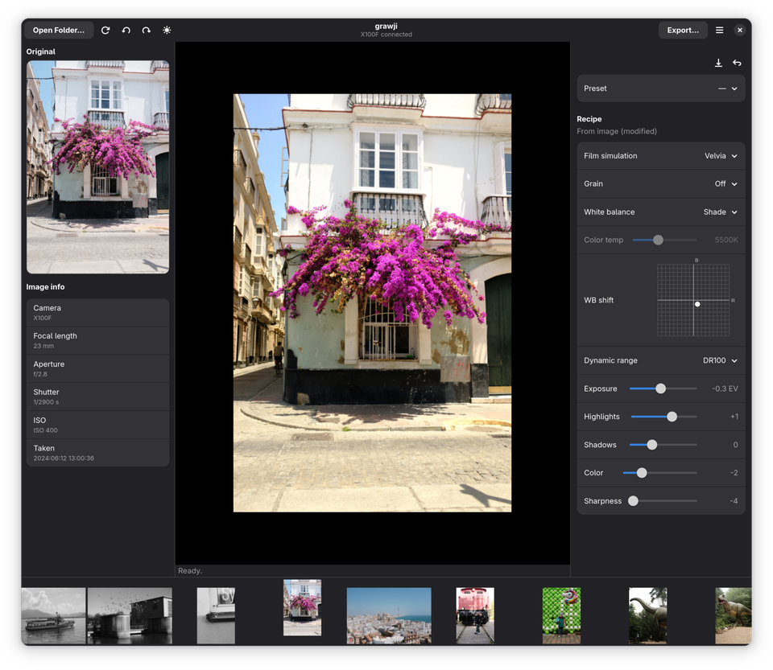

# grawji

[](https://www.python.org/downloads/)
[](LICENSE)
[](https://github.com/p5k369/grawji/actions/workflows/test.yml)
[](https://codecov.io/gh/p5k369/grawji)
[](https://results.pre-commit.ci/latest/github/p5k369/grawji/main)


GTK4 frontend for [rawji](https://github.com/pinpox/rawji). Develop Fujifilm
RAFs natively on Linux through the **real camera engine** (authentic film
simulations, identical to X RAW STUDIO).

The name is **g**(tk) + **rawji**. rawji is command-line only, grawji makes
*interactive* work on the look practical: set a recipe, see a live preview,
export.

<p align="center">
  
</p>

## Features

- **Live preview** through the camera's own conversion engine. What you see
  is what the camera would write.
- **Full recipe control**: film simulation, white balance, dynamic range,
  highlights, shadows, color and sharpness.
- **Start from the image's own settings** (toggleable) or keep a sticky recipe
  and apply it across shots.
- **Recipes**: save, apply and delete named recipes. Import and export them
  in X RAW Studio's FP format (FP1/FP2/FP3), so a recipe from Fujifilm X RAW
  Studio drops straight in (and back out). grawji maps the
  parameters it supports. Effects it does not model are left neutral.
- **Filmstrip** browser with EXIF info for the selected RAF.
- **Export** single images or batch-export a whole folder at full resolution.
- Keyboard shortcuts, pan/zoom with a darktable-style background, and a
  remembered window size and last folder.

## Architecture

rawji is imported as a library. grawji is a GTK4 UI plus a thin adapter
(`grawji.core`) around rawji's public API, following a **load-once,
render-many** workflow:

- **Open RAF** (once, slow): `connect → send_raf → get_profile`
- **Change recipe** (often, fast — session + RAF stay open):
  `rmw_patch(base, recipe) → set_profile → trigger_conversion → wait_for_result`
- **Quit**: `disconnect`


## Install

Three ways to get grawji: the **[Flatpak](#flatpak)** (bundled, one command,
for everyone), **[Nix](#nix)** (flake), or **[from source](#from-source)**.

First, put the camera in RAW-conversion USB mode, otherwise it enumerates as
a card reader and rawji cannot talk to it:

> **Set Up** → **Connection Setting** → **USB Mode** → **USB RAW CONV./BACKUP RESTORE**

### Flatpak

Bundles everything (GTK4, libadwaita, the EXIF and USB stacks, rawji and
grawji), only the shared GNOME runtime comes from the network.

<details>
<summary><b>Step-by-step</b></summary>

**1. Set up Flatpak and Flathub** (most distros ship Flatpak):

```sh
flatpak remote-add --if-not-exists --user \
  flathub https://flathub.org/repo/flathub.flatpakrepo
```

**2. Install** `grawji.flatpak` from the
[Releases](https://github.com/p5k369/grawji/releases) page (the first install
also pulls the shared GNOME runtime, a few hundred MB, fetched once):

```sh
flatpak install --user grawji.flatpak
```

**3. Run:**

```sh
flatpak run io.github.p5k369.grawji
```

</details>

### Nix

The repo is a flake. With `nix` and flakes enabled, run it straight from
GitHub, no clone required:

```sh
nix run github:p5k369/grawji
```

`nix build github:p5k369/grawji` produces `./result/bin/grawji`. The flake
exposes `packages.<system>.{grawji,rawji}`, so you can also add grawji as an
input to your own flake.

### From source

GTK4 and PyGObject come from your distribution, not pip: install the system
packages, then `make install`.

<details>
<summary><b>Step-by-step</b></summary>

**1. System packages** (GTK4, libadwaita, PyGObject, the GExiv2 EXIF reader,
and the USB stack). Names vary by distro:

| Distro | Install |
| --- | --- |
| Debian / Ubuntu | `apt install git make python3-gi gir1.2-gtk-4.0 gir1.2-adw-1 gir1.2-gexiv2-0.10 libgtk-4-1 libusb-1.0-0` |
| Fedora | `dnf install git make python3-gobject gtk4 libadwaita gexiv2 libusb1` |
| Arch | `pacman -S git make python-gobject gtk4 libadwaita gexiv2 libusb` |
| openSUSE | `zypper install git make python3-gobject gtk4 libadwaita-1-0 typelib-1_0-GExiv2-0_10 libusb-1_0-0` |
| Gentoo | `emerge dev-vcs/git sys-devel/make dev-python/pygobject gui-libs/gtk:4 gui-libs/libadwaita media-libs/gexiv2 dev-python/pyusb virtual/libusb` |

**2. Clone and install** (`make install` builds a venv with
`--system-site-packages` so it can import the system GTK, fetches rawji from
git, installs grawji):

```sh
git clone https://github.com/p5k369/grawji
cd grawji
make install
make run        # or: .venv/bin/python -m grawji
```

USB access: most distributions already grant non-root access via `uaccess` or
`plugdev`; if yours does not, add a udev rule for the Fuji vendor id `0x04cb`
(check first).

</details>

## Development

`make dev` builds the venv with the dev extras and installs the pre-commit
hooks. To hack on rawji too (e.g. add a camera product id), clone it next to
grawji and override the dependency with an editable checkout:

```sh
make dev RAWJI="-e ../rawji"
```

`make lint` runs ruff + `mypy src tests`, `make format` formats, `make test`
runs pytest (line length 79). `pygobject-stubs` (a dev dependency) gives the
editor type hints for GTK and libadwaita.

To build the Flatpak (needs `flatpak-builder` and the GNOME 50 runtime/SDK),
`make flatpak` builds and installs it. `make flatpak-bundle` writes a
single-file `grawji.flatpak`. The manifest is `flatpak/io.github.p5k369.grawji.yaml`,
it builds fully offline (the build backend is vendored as pinned wheels).

## Credits

grawji stands entirely on [rawji](https://github.com/pinpox/rawji) by
**[pinpox](https://github.com/pinpox)**, who did the hard work of talking to
the camera's conversion engine over USB and exposing it as a clean Python
library. grawji is just a GTK4 face on top of that. Thank you. And if you
find grawji useful, please go star rawji.

The profile format was reverse-engineered by
**[petabyt](https://github.com/petabyt)**, whose
[fp](https://github.com/petabyt/fp) and
[libfuji](https://github.com/petabyt/libfuji) are the authoritative reference
for the camera's d185 conversion profile. grawji's parameter encodings (e.g.
noise reduction, processor capabilities) were verified against that work.

## License

GPL-3.0-or-later. grawji imports rawji (copyleft), so grawji itself must be
GPL-3.0-or-later.
