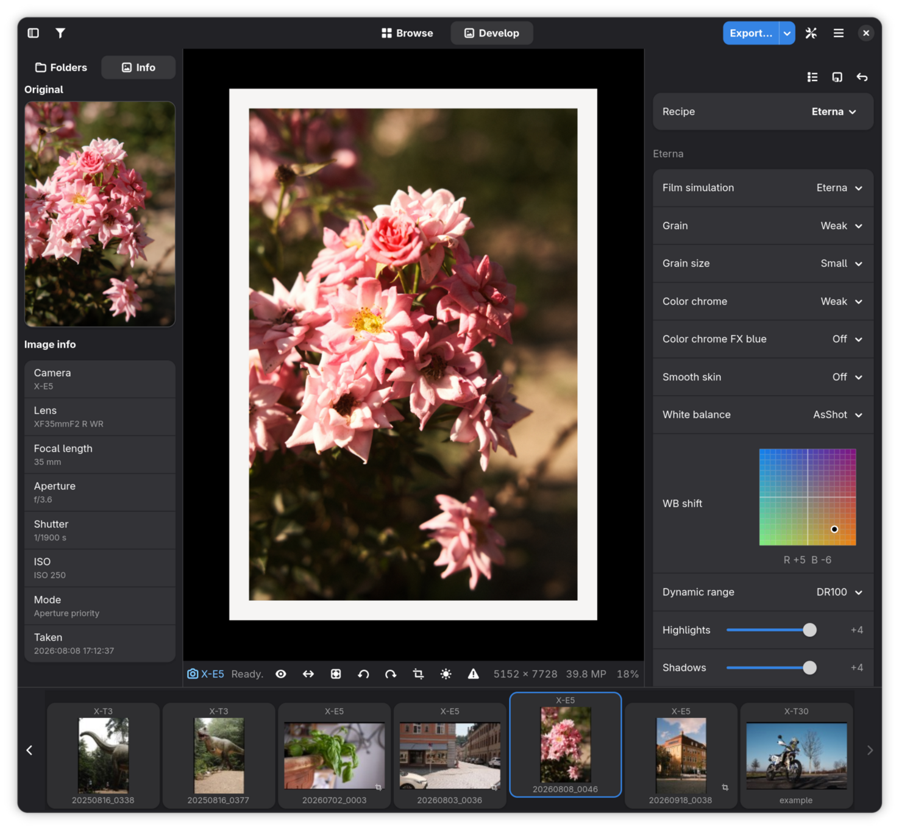

# grawji

[](https://www.python.org/downloads/)
[](LICENSE)
[](https://github.com/p5k369/grawji/actions/workflows/test.yml)
[](https://codecov.io/gh/p5k369/grawji)
[](https://results.pre-commit.ci/latest/github/p5k369/grawji/main)


GTK4 frontend for [rawji](https://github.com/pinpox/rawji). Develop Fujifilm
RAFs natively on Linux through the **real camera engine** (authentic film
simulations, identical to X RAW STUDIO).

The name is **g**(tk) + **rawji**. rawji is command-line only, grawji makes
*interactive* work on the look practical: set a recipe, see a live preview,
export.

<p align="center">
  
</p>

## Features

- **Live preview** through the camera's own conversion engine. What you see
  is what the camera would write.
- **Full recipe control**: film simulation, white balance, dynamic range,
  highlights, shadows, color and sharpness.
- **Recipes**: save, apply and delete named recipes. Import and export them
  in X RAW Studio's FP format (FP1/FP2/FP3), so a recipe from Fujifilm X RAW
  Studio drops straight in (and back out). grawji maps the
  parameters it supports. Effects it does not model are left neutral.
- **Export** single images or batch-export a whole folder at full resolution.
- **Experimental**: write recipes into the camera's C1-C7 custom banks
  over USB, on X-Processor 5 bodies and on the X100F/X-T3 generation, and
  into the X-E5's FS1-FS3 film-simulation dial positions. Verified on
  X-Processor 5 and X100F/X-T3 hardware. Every write is read back and
  checked. Values a body cannot store are reported as dropped instead of
  written wrong.

## Warranty disclaimer

Fujifilm's official
[Camera Control SDK page](https://www.fujifilm-x.com/global/camera-control-sdk/)
states, verbatim:

> USING THIS SDK TO CONNECT TO OR CONTROL, ANY COMPATIBLE FUJIFILM CAMERA
> WILL VOID THE CAMERA'S LIMITED PRODUCT WARRANTY.

grawji and rawji do not use that SDK, but they talk to the camera over the
same USB protocol and are not licensed by Fujifilm.
[Reporting based on statements from Fujifilm](https://fujixweekly.com/2026/06/08/your-cameras-warranty-might-be-voided/)
says the policy extends to any non-licensed program connecting to the
camera, and that the camera records a marker each time one connects.
Consumer-protection law in your country may limit or override such terms,
but do not count on it: **use grawji at your own risk.**

## Install

First, put the camera in RAW-conversion USB mode, otherwise rawji cannot talk to it:

> **Set Up** → **Connection Setting** → **USB Mode** → **USB RAW CONV./BACKUP RESTORE**

| How | Install | Notes                                                                                    |
| --- | --- |------------------------------------------------------------------------------------------|
| **Flatpak** | `flatpak install --user grawji.flatpak` | bundle from [Releases](https://github.com/p5k369/grawji/releases), everything included   |
| **Nix** | `nix run github:p5k369/grawji` | flake, no clone needed. `nix build` gives `./result/bin/grawji`                          |
| **Gentoo** | `emerge media-gfx/grawji` | in [GURU](https://wiki.gentoo.org/wiki/Project:GURU), `~amd64`, pulls `dev-python/rawji` |
| **Source** | `make install` | system GTK4/PyGObject first, see below                                                   |

<details>
<summary><b>Flatpak, step-by-step</b></summary>

**1. Set up Flatpak and Flathub** (most distros ship Flatpak):

```sh
flatpak remote-add --if-not-exists --user \
  flathub https://flathub.org/repo/flathub.flatpakrepo
```

**2. Install** `grawji.flatpak` from the
[Releases](https://github.com/p5k369/grawji/releases) page (the first install
also pulls the shared GNOME runtime, a few hundred MB, fetched once):

```sh
flatpak install --user grawji.flatpak
```

**3. Run:**

```sh
flatpak run io.github.p5k369.grawji
```

</details>

<details>
<summary><b>Gentoo, step-by-step</b></summary>

Enable the overlay and accept the `~amd64` keywords once:

```sh
eselect repository enable guru
emerge --sync guru
echo "media-gfx/grawji ~amd64
dev-python/rawji ~amd64" >> /etc/portage/package.accept_keywords/grawji
emerge -av media-gfx/grawji
```

</details>

<details>
<summary><b>From source, step-by-step</b></summary>

GTK4 and PyGObject come from your distribution, not pip: install the system
packages, then `make install`.

**1. System packages** (GTK4, libadwaita, PyGObject, the GExiv2 EXIF reader,
and the USB stack). Names vary by distro:

| Distro | Install |
| --- | --- |
| Debian / Ubuntu | `apt install git make python3-gi gir1.2-gtk-4.0 gir1.2-adw-1 gir1.2-gexiv2-0.10 libgtk-4-1 libusb-1.0-0` |
| Fedora | `dnf install git make python3-gobject gtk4 libadwaita gexiv2 libusb1` |
| Arch | `pacman -S git make python-gobject gtk4 libadwaita gexiv2 libusb` |
| openSUSE | `zypper install git make python3-gobject gtk4 libadwaita-1-0 typelib-1_0-GExiv2-0_10 libusb-1_0-0` |
| Gentoo | `emerge dev-vcs/git sys-devel/make dev-python/pygobject gui-libs/gtk:4 gui-libs/libadwaita media-libs/gexiv2 dev-python/pyusb virtual/libusb` |

**2. Clone and install** (`make install` builds a venv with
`--system-site-packages` so it can import the system GTK, fetches rawji from
git, installs grawji):

```sh
git clone https://github.com/p5k369/grawji
cd grawji
make install
make run        # or: .venv/bin/python -m grawji
```

USB access: most distributions already grant non-root access via `uaccess` or
`plugdev`. If yours does not, add a udev rule for the Fuji vendor id `0x04cb`
(check first).

</details>

## Development

`make dev` builds the venv with the dev extras and installs the pre-commit
hooks. To hack on rawji too (e.g. add a camera product id), clone it next to
grawji and override the dependency with an editable checkout:

```sh
make dev RAWJI="-e ../rawji"
```

`make lint` runs ruff + `mypy src tests`, `make format` formats, `make test`
runs pytest (line length 79). `pygobject-stubs` (a dev dependency) gives the
editor type hints for GTK and libadwaita.

To build the Flatpak (needs `flatpak-builder` and the GNOME 50 runtime/SDK),
`make flatpak` builds and installs it. `make flatpak-bundle` writes a
single-file `grawji.flatpak`. The manifest is `flatpak/io.github.p5k369.grawji.yaml`,
it builds fully offline (the build backend is vendored as pinned wheels).

## Credits

grawji stands entirely on [rawji](https://github.com/pinpox/rawji) by
**[pinpox](https://github.com/pinpox)**, who did the hard work of talking to
the camera's conversion engine over USB and exposing it as a clean Python
library. grawji is just a GTK4 face on top of that. Thank you. And if you
find grawji useful, please go star rawji.

The profile format was reverse-engineered by
**[petabyt](https://github.com/petabyt)**, whose
[fp](https://github.com/petabyt/fp) and
[libfuji](https://github.com/petabyt/libfuji) are the authoritative reference
for the camera's d185 conversion profile. grawji's parameter encodings (e.g.
noise reduction, processor capabilities) were verified against that work.

## License

GPL-3.0-or-later. grawji imports rawji (copyleft), so grawji itself must be
GPL-3.0-or-later.
